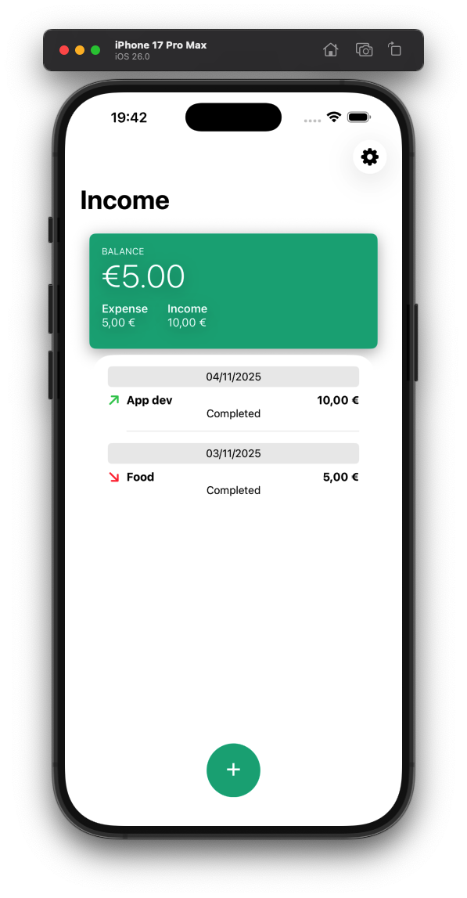
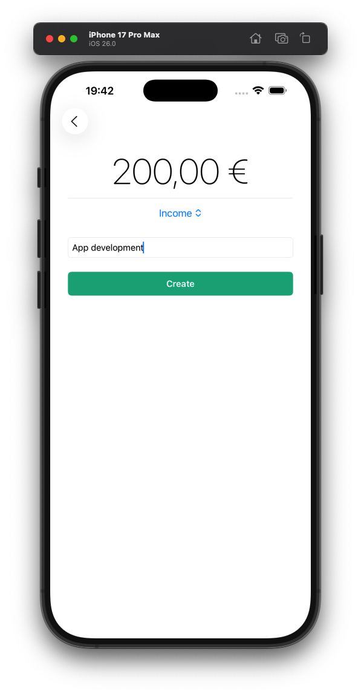
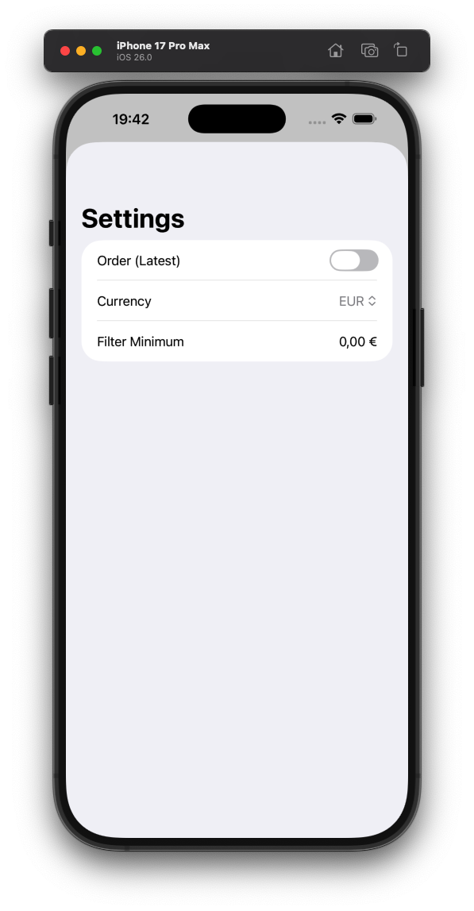

# Income & Expense Tracker (SwiftUI and SwiftData)

A simple **Income & Expense Tracker** built with SwiftUI and SwiftData.  
Users can **add incomes and expenses, edit or delete them**, and the app automatically updates the **balance**.  

---

## Features
- Add new **income** or **expense**  
- Edit existing entries  
- Delete entries with a swipe  
- Real-time balance updates  
- Clean and modern **SwiftUI** interface  

---

## Screenshots

  
  
  

---

## Getting Started

### Requirements
- iOS 26+
- Xcode 15+
